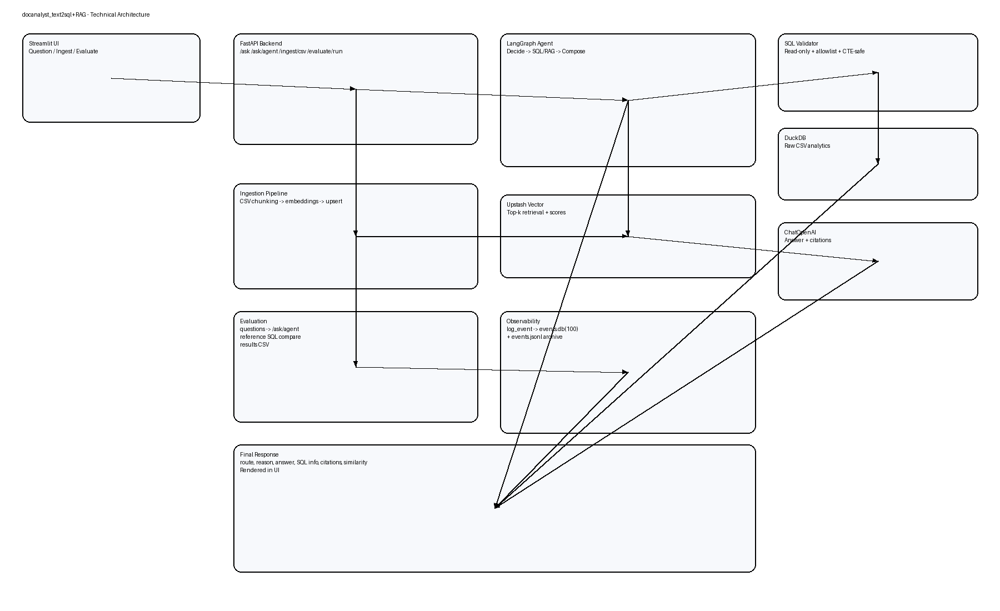

# RAG-based Document Q&A (LangChain + Upstash Vector)

A hybrid Document Q&A prototype that combines:
- **RAG retrieval** for semantic/document questions
- **Exact analytics** for numeric aggregation questions

Current implementation is notebook-first in `docs_assistant.ipynb`.

## Technical Architecture Diagram



---

## What This Project Solves

For large datasets and mixed question types:
- Vector retrieval is great for semantic understanding.
- Exact computations are required for numeric truth (max/min/avg/sum/count).

This project routes questions to the right path:
- `route=rag` -> Upstash Vector + LLM
- `route=analytics` -> pandas exact computation

---

## Stack

- Python + Jupyter
- LangChain (`langchain-openai`, `langchain-community`)
- OpenAI:
  - `ChatOpenAI` (`gpt-4.1-mini`)
  - `OpenAIEmbeddings` (`text-embedding-3-small`)
- Upstash Vector (Dense, 1536 dimensions, COSINE)
- pandas for tabular analytics

---

## Setup

## 1) Create and activate virtual environment

```powershell
python -m venv .venv
.\.venv\Scripts\activate
```

## 2) Install dependencies

```powershell
python -m pip install -U langchain langchain-openai langchain-community langchain-core langchain-text-splitters upstash-vector pandas notebook ipykernel python-dotenv
```

## 3) Configure environment variables

Create `.env` in project root:

```env
OPENAI_API_KEY=...
UPSTASH_VECTOR_REST_URL=...
UPSTASH_VECTOR_REST_TOKEN=...
```

---

## Upstash Vector Index Settings

Recommended:
- Type: `Dense`
- Dimensions: `1536`
- Metric: `COSINE`

These settings match `OpenAIEmbeddings(model="text-embedding-3-small")`.

---

## Run the Notebook

1. Open `docs_assistant.ipynb`
2. Select `.venv` kernel
3. Run cells top-to-bottom:
   - env load and validation
   - vector store init
   - CSV ingestion (chunked, memory-safe)
   - batched vector upsert
   - retrieval tests
   - hybrid router + example questions

---

## Hybrid Routing

The notebook exposes:

```python
ask(question, csv_path, store, llm)
```

Routing logic:
- analytics keywords (`max`, `highest`, `average`, `sum`, `count`, etc.) -> exact pandas route
- everything else -> RAG route with citations

Example:

```python
print(ask("What is the highest sell price in the dataset?", str(csv_path), store, llm))
print(ask("Which item_ids around HOBBIES show stable prices in indexed chunks?", str(csv_path), store, llm))
```

---

## Why Hybrid Matters

For very large CSVs, semantic retrieval alone can produce plausible but non-exact numeric answers.

Use:
- **analytics route** for exact numeric results
- **RAG route** for semantic and explanatory answers

---

## Project Files

- `docs_assistant.ipynb` - main prototype notebook
- `RAG_DOCUMENT_QA_PRODUCT.md` - detailed product/architecture document
- `basics.ipynb` - earlier LangChain learning notebook

---

## Next Steps

- Expand analytics handlers (min/avg/sum/count/group-by/top-N)
- Add stronger citation controls and source snippets
- Convert notebook logic into FastAPI endpoints:
  - `POST /ingest/csv`
  - `POST /ask`
  - `GET /health`
- Add logging, retries, and dataset isolation for production

---

## Observability and Evaluation

### Runtime logs

The API now logs events into SQLite:

- DB file: `observability/events.db`
- Logged fields include:
  - endpoint (`/ask`, `/ask/agent`, `/ingest/csv`)
  - question, route, route_reason
  - SQL query/error
  - citation count
  - RAG similarity summary
  - latency and success/failure

This helps track performance/regression over time.
To keep storage lightweight, only the **latest 100 events** are retained.

### Evaluation harness

Use:

```powershell
.\.venv\Scripts\python.exe evaluation.py --api http://127.0.0.1:8000 --csv "C:\Users\1036506\Downloads\data_M5\sell_prices.csv" --questions eval_questions.json
```

Outputs:
- `observability/eval_results_<timestamp>.csv`
- terminal summary (Correct / Partially Correct / Incorrect)

